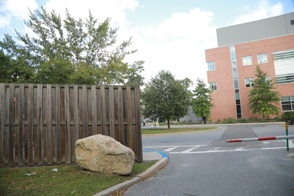
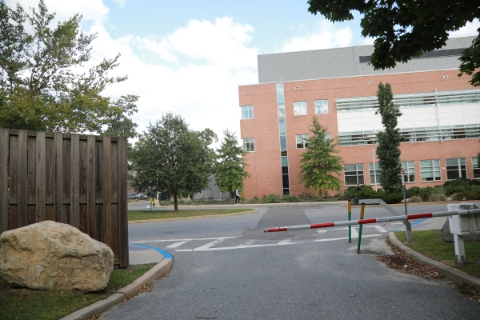
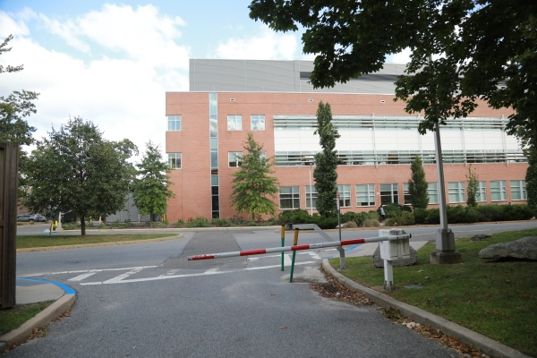
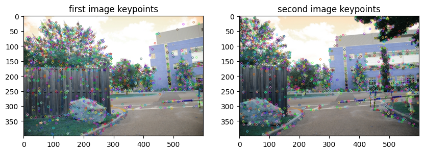
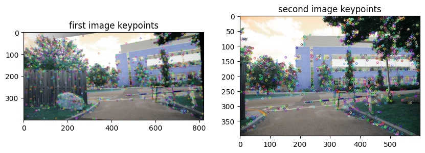
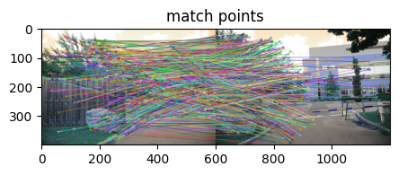
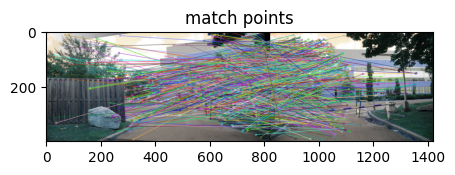

# Scene Stitching!

## Overview
 This project focuses on scene stitching and creating panoramic images by  SIFT algorithm. Stitching multiple images together to create a panorama .

## Steps

To create panoramas using the SIFT algorithm, we follow a series of key steps:

1. **Feature Extraction and Key Points**: The process begins by extracting distinctive features from each input image.  These key points serve as the basis for aligning and stitching the images.

2. **Matching Common Feature Points**: After extracting key points from each image, the algorithm matches common feature points between the images. This step involves comparing the descriptors of key points to find matches.

3. **Calculating the Homography Matrix**: Once common feature points are identified, the homography matrix is computed. This matrix defines the geometric transformation needed to align the images properly.

4. **Stitching the Pictures Together**: With the homography matrix calculated, the images are warped and blended to create a cohesive panorama. 

These steps, when executed correctly, result in a high-quality panoramic image that seamlessly combines multiple input images. 

## Results

After applying the SIFT-based panorama stitching algorithm to your images, you can expect impressive panoramic results that seamlessly merge multiple photos into a single cohesive view. Here are some examples of panoramas created using our algorithm:

#### Picture 1

*left picture*

#### Picture 2

*middle picture*

#### Picture 3

*right picture*

### features between left and middle

#### features1-2

### features between middle and right

#### features2-3

### matches between left and middle

#### mathes1-2

### matches between middle and right

#### mathes2-3

